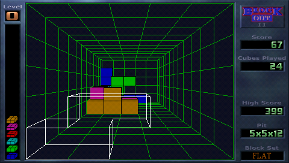
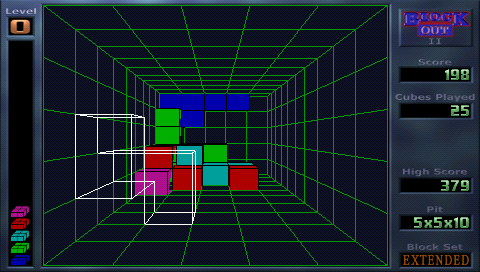
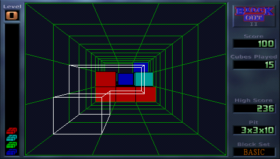

# BlockOut_II_PSP

BlockOut_II_PSP is a Sony Playstation Portable port of BlockOut II game by Jean-Luc PONS.

http://www.blockout.net/blockout2

BlockOut II is reimplementation of original 1989 puzzle video game, developed in Poland by
Aleksander Ustaszewski and Mirosław Zabłocki and published by California Dreams for multiple
platforms. Original BlockOut was first video game which transfered tetris from 2D into 3D.

https://en.wikipedia.org/wiki/Blockout

This port is based on BlockOut II release 2.5

## Game screenshots

Screenshots of different block sets

  
  
  

## Binary installation

https://github.com/bomblik/BlockOut_II_PSP/releases

Copy BlockOut_II directory to Sony PSP device
(e.g. to ms0:/psp/game directory on Memory Stick).

## Source installation

### Compilation

In order to compile BlockOut_II_PSP, please install psptoolchain
and set development environment.

To compile project invoke

    cd ImageLib/src
    make -f Makefile.psp

    cd ../../BlockOut
    make -f Makefile.psp

To prepare data for installation invoke

    make -f Makefile.psp release

That would create all required data in BlockOut_II directory

### Installation

Copy BlockOut_II directory to Sony PSP device
(e.g. to ms0:/psp/game directory on Memory Stick).

## Key mappings

    CROSS                    - confirm / drop block
    RIGHT TRIGGER            - cancel / exit game

    D-PAD                    - move block / select character (hall of fame)

    SQUARE                   - rotate block around X axis counterclockwise
    SQUARE   + LEFT TRIGGER  - rotate block around X axis clockwise
    TRIANGLE                 - rotate block around Y axis counterclockwise
    TRIANGLE + LEFT TRIGGER  - rotate block around Y axis clockwise
    CIRCLE                   - rotate block around Z axis counterclockwise
    CIRCLE   + LEFT TRIGGER  - rotate block around Z axis clockwise

    START                    - pause / resume game

## Online score database

You can play against / compare your score to online score database, using wifi connection.

